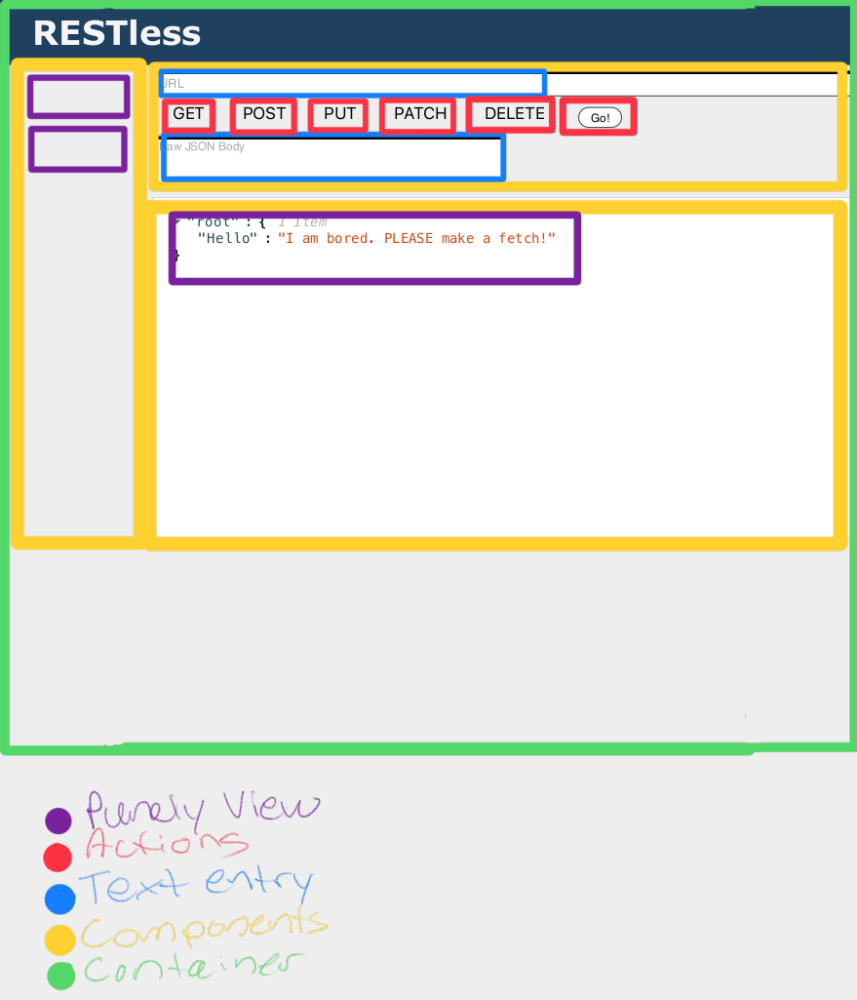

# restella API Client

Restella is a simple browser-based Server API Client, much like Postman or ThunderClient. You can make general HTTP requests to various APIs that you are testing or exploring. You can easily view the resulting JSON from the API call within the Results section and revisit old queries within the Request History block. 

### Development and usage instructions
Development:
- Clone repo locally; 
  - `git clone git@github.com:juliannevela/restella-client.git`
  - `cd restella-client`
- Install depenedencies;
  - `npm install`
- Run app
  - `npm run start`
  - Open browser to localhost:3000

Usage: 
- Enter an API url that you want to test (eg. `https://jsonplaceholder.typicode.com/users/1/todos`)
- Select the HTTP request type that you'd like to use (eg. `GET`)
- Press 'GO'

- Preview JSON results from your API call within the Results section below. 

- If you would like to revisit a previous API call you made, you can do so via the `Request History` column on the left. 


<hr>

### The Plan

```
.
└── src
├── containers
│ └── restella.jsx
└── components
├── HISTORY
│ ├── item.jsx
│ └── list.jsx
├── CONTROLS
│ └── form.jsx
│ ├── urlInput.jsx
│ ├── methods.jsx
│ └── jsonInput.jsx
└── RES-DISPLAY
└── jsonViewer.jsx
```

### Tools Needed

- React
- react-json-view

### Diagram


